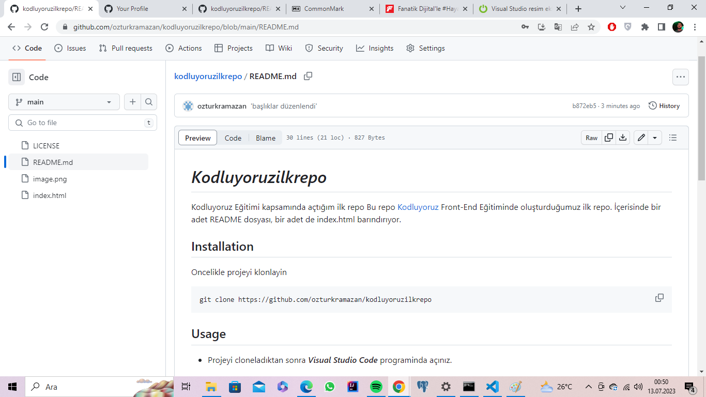

# ***Kodluyoruzilkrepo***
Kodluyoruz Eğitimi kapsamında açtığım ilk repo
Bu repo [Kodluyoruz](https://kodluyoruz.org/) Front-End Eğitiminde oluşturduğumuz ilk repo. İçerisinde bir adet README dosyası, bir adet de index.html barındırıyor.
## **Installation**
Oncelikle projeyi klonlayin

```bash
git clone https://github.com/ozturkramazan/kodluyoruzilkrepo

```

## **Usage**
* Projeyi cloneladıktan sonra ***Visual Studio Code*** programinda açınız.

* *Microsoft* için:
```microsoft
cd kodluyoruzilkrepo
code .
```

## **Contributing**
Pull requestler kabul edilir. Büyük değişiklikler için, lütfen önce neyi değiştirmek istediğinizi tartışmak için bir konu açınız.

## **License**
[MIT](https://choosealicense.com/licenses/mit/)

## **Projemizin ilk fotoğrafı**



