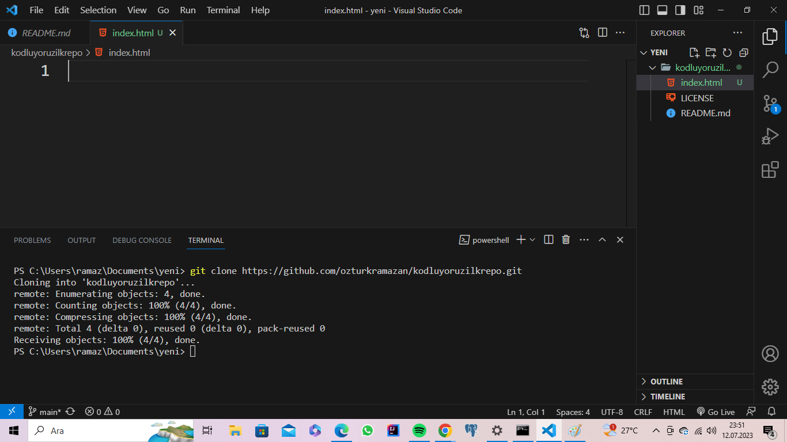

# kodluyoruzilkrepo
Kodluyoruz Eğitimi kapsamında açtığım ilk repo
Bu repo Kodluyoruz Front-End Eğitiminde oluşturduğumuz ilk repo. İçerisinde bir adet README dosyası, bir adet de index.html barındırıyor.
## Installation
[Oncelikle projeyi klonlayin](https://github.com/ozturkramazan/kodluyoruzilkrepo)

## Usage
Projeyi cloneladıktan sonra Visual Studio Code programinda açınız.

## Contributing
Pull requestler kabul edilir. Büyük değişiklikler için, lütfen önce neyi değiştirmek istediğinizi tartışmak için bir konu açınız.

## License
[MIT](https://choosealicense.com/licenses/mit/)

## ![projemizin ilk fotografi]

